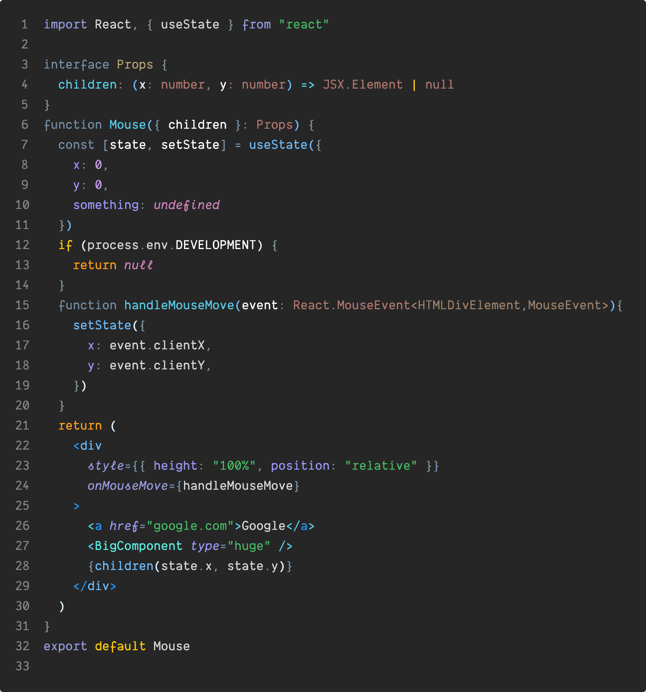
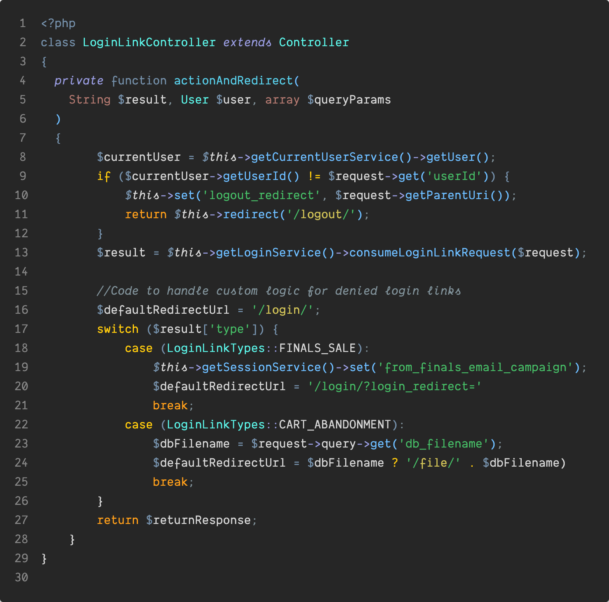

# Chandrian VS Code Color Theme

Chandrian is a **semantic** syntax highlighting theme, designed explicitly to make scanning large code-bases easier and to make errors more obvious. It features a 16-color palette with a mixture of carefully chosen warm, cold, and neutral colors. The colors are broadly categorized into:

- Warm Colors for **action** keywords - `throw`, `return` in programming languages, links in Markdown files.
- Cold colors for **definitions** - Function names, variable values etc.
- Muted neutral colors for punctuation, comments, and anything else which detracts from the code.

All colors have a contrast ratio of at least 4.5:1 and meet the criteria for "AA" accessibility level defined by the Web Content Accessibility Guidelines (WCAG). 

# Features

## Programming languages

The colors for programming languages are designed to ease congnitive parsing of large blocks of code. 

- Exit keywords (`return`/`throw`) and control keywords (`if`, `for` etc.) are assigned complementary warm colors bright enough to immediately catch your eye on a quick scan through.
- Function definitions / functional calls / property names are assigned complementary cold colors.
- Semi-colons, curly-braces etc are important for the compiler but are just visual noise for humans, and are hence shown in muted colors.
- Comments are important and helpful, but secondary to the actual code and are also muted.
- 'function', 'var', 'const' and other language keywords also toned down.
- Variable declarations are brighter than regular variables. I'm on the fence about if this helps or distracts (opinions welcome on Github issues); see notes below for instructions on turning this off. 
- `=` is assigned a contrasting color to `==` so you can immediately catch if typo one for the other.




These rules should apply to most languages but were specifically designed for JS/Typescript. If something looks off in a particular language, issues/ PRs are welcome.

## HTML

- Different colors for Block / Inline / Input elements / Web components.
- Classes are the most commonly used attribute and are shown more prominent than others, to help visually scan.
- `href`, form `action` attribute values, and inline event handlers  are treated as action triggers and assigned brighter 'warm' colors.
- `data-` attributes are highlighted.
- Un-recognized tags show up brightly. Lifesaver if you chronically mistype 'form' as 'from' as I do.
- Errors, like say an extra angled `<` before an element are highlighted in red, as you can quickly see/scan from the screenshot.


## CSS

- Different selector-types (element selectors / id selectors / attribute selectors/ pseduo-classes) are assigned different colors.
- Color definitions are shown in white. I recommend turning on VS Code's color preview so you can visually see the color next to its name.
- Mixins / variables / built-in functions are treated as actions and shown in warm colors.
- Vendor prefixes are 'noise' and are muted.
- Semicolons, colons etc. are all language noise and are muted.
- Known attribute values (relative / block etc.) are colored while unknown ones are not (position vs positon), to help catch typos.
- Known property-names (color / margin etc.) are colored while unknown ones are not, providing immediate feedback if you get it wrong.
- Obsolete properties are also shown as errors.


## JSON
Common issues when working with large JSON files are:

1. Losing track of what level of nesting you're in, while parsing deeply-nested JSON.
2. Accidental trailing commas.
3. Missing a matching `}` somewhere.

This theme solves that by:
- Assigning each nested key-value pair is a different color combination, to help keep track of where you are (up to 5 levels. If you have to deal with structures deeper than that you have my sympathies).
- Making trailing commas visually more prominent.
- Using bright error colors to let you catch track down issues with malformed json.


## Markdown
This theme is designed to enhance readability of Markdown documents and hence uses a minimum of colors in Markdown files.

- Header colors lighten for each heading level, to help you keep track of where you are.
- Italics are italicized, bolds are brighter.
- Links and `code` use warm colors
- De-emphasized urls minimize visual clutter.


## VS Code Editor styling

Minimal changes has been made to the styling of VS Code itself, primarily:

- Changed the obnoxious blue of the activity bar to a more unobtrusive gray. 
- Muted whitespace characters and other invisibles.

## Misc. notes:

### Theme variants / font suggestions
The default theme incorporates italics and works best with a font like Operator Mono / Danke Mono. There's also a non-italic variant for everything else - I recommend the excellent Source Code Pro.

### How to turn off highlights for variable definitions
Add the following to your VS Code settings:
```json
"editor.tokenColorCustomizations": {
    "[Chandrian Blue]": {
        "textMateRules": [{
            "scope": [
                "meta.definition.variable variable",
                "variable.other.constant"
            ],
            "settings": {
                "foreground": "#FFFFFFD4"
            }}]}}
```

## Other misc. screenshots



