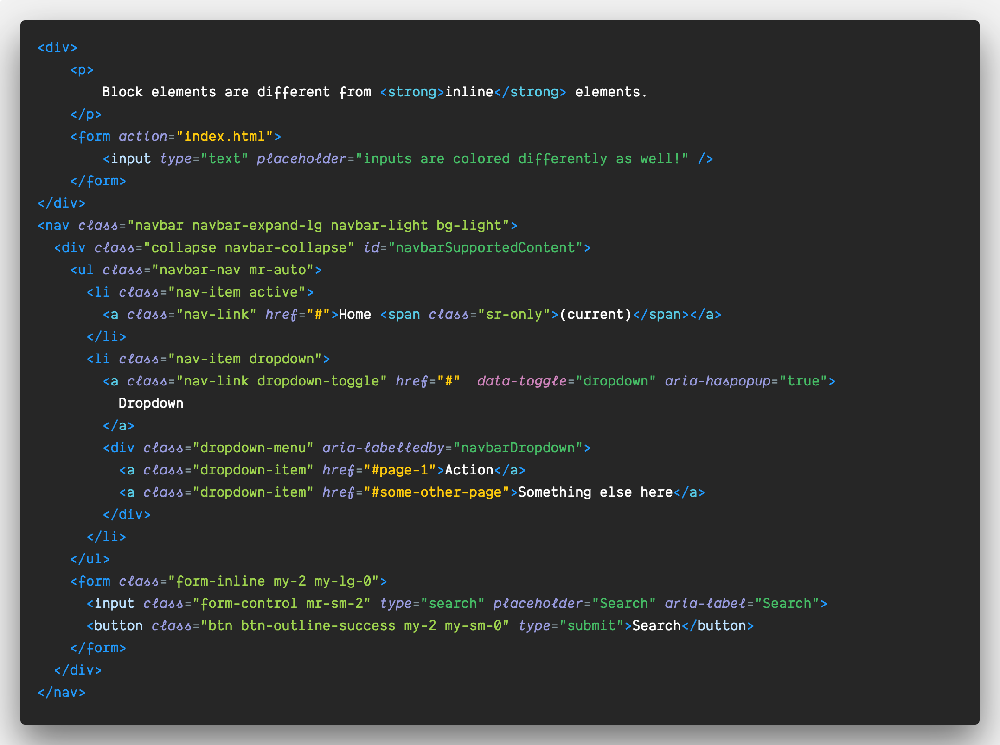
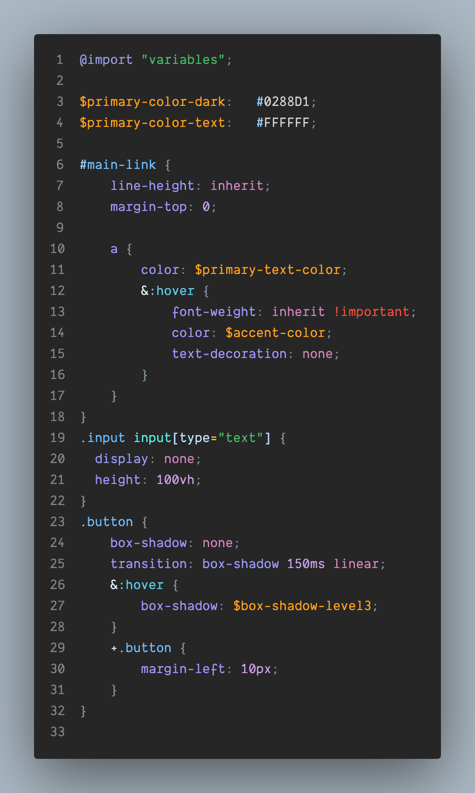
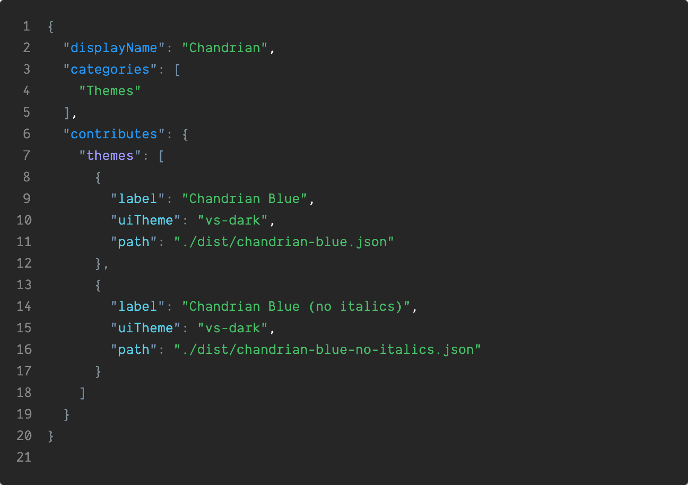
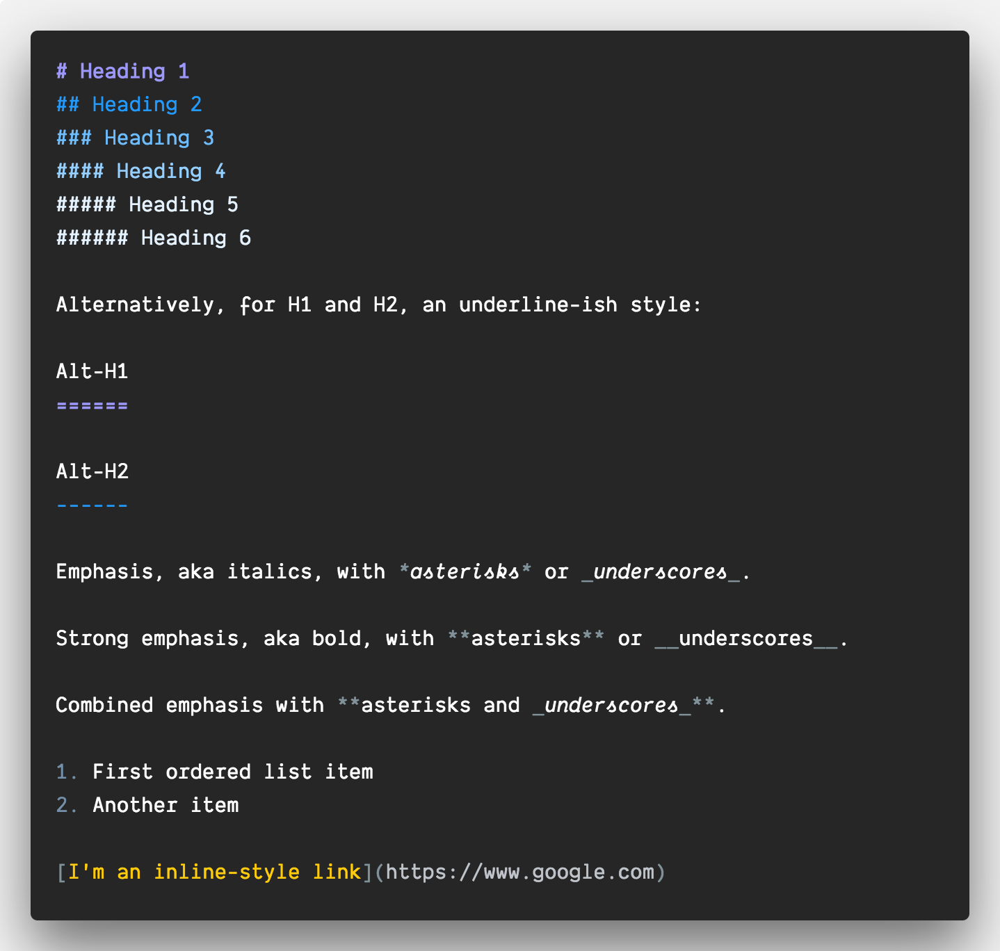
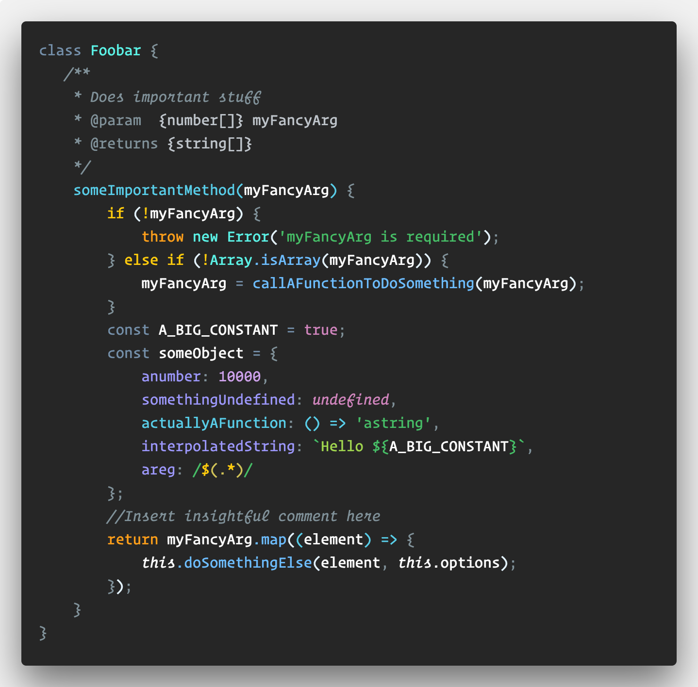
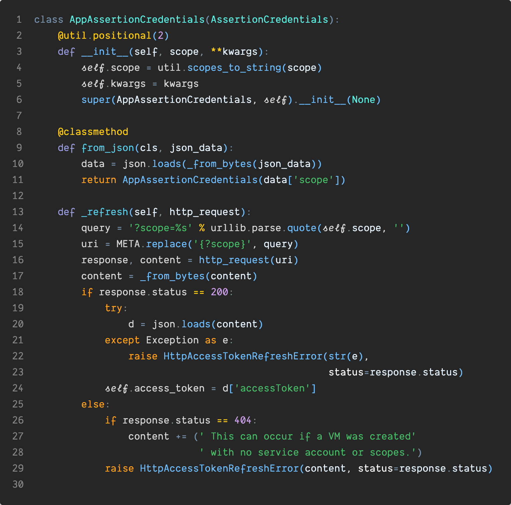

# Chandrian VS Code Color Theme

Chandrian is the first semantic syntax highlighter designed for VS Code and Sublime Text. It features a 16-color palette with a mixture of carefully chosen warm, cold, and neutral colors. It’s designed to easily scan large code-bases and highlight errors your linter doesn't catch.

- Actions, or control keywords, (`throw`, `return` etc.) use warm colors.
- Function definitions and static kewords use cold colors.
- Language keywords (`function`,  `var` etc.), and misc. punctuation (semi-colons, curly braces) classified as 'noise' use subdued shades of gray.

## HTML Features

### Tags
- Different colors for Block vs Inline Elements vs. input elements
- Un-recognized tags show up as errors. Lifesaver if you chronically mistype 'form' as 'from' as I do.

## Attribute Values
- classes are visually more prominent than other attributes, to help visually scan them.
- 'href', and form 'action' attribute values are 'warm' colors.

## Attribute Names
- Inline event handlers are bright warm colors.
- `data-` attributes are highlighted.

## CSS Features:

### Selectors 
- Different colors for different selector-types:
    * element selectors,
    * class-based / ID selectors
    * attribute selectors
    * pseduo-elements / pseduo-classes
- Mis-spelled elements / id-selectors that you forgot the leading '#' for are highlighted in red.

- Known attribute values (relative / block etc.) are colored while unknown ones are not (position vs positon), to help catch typos.
- Known property-names (color / margin etc.) are colored while unknown ones are not (colour / magrin), to help catch typos.

- All color definitions are shown in white. I recommend turning on VS Code's color preview so you can visually see the color next to it's name.

- Vendor prefixes are 'noise' and are muted
- Obsolete properties are shown as errors
- Semicolons, colons are all language noise and are muted

## JSON Features:
The biggest problems I have with JSON files are:

1. I get lost in the nesting and have trouble keeping track of where I am
2. Trailing commas

This theme solves that by
- Each nested key-value combination is assigned a different color combination, to help keep track of where you are in deeploy nested JSON structures (up to 5 levels. If you have to deal with structures deeper nesting you have my sympathies).
- Commas are visually more prominent.
The single biggest mistake I make with JSON files is adding commas at the end.
- Bright error colors to let you catch track down issues in malformed json

## Markdown:

This theme is designed to enhance readability of Markdown documents and hence uses a minimum of colors.

- Header colors lighten for each heading level, to help you keep track of where you are.
- Italics are italicized, bolds are brighter.
- Links and `code` use warm colors
- De-emphasized urls to minimize visual clutter.

## Programming Languages:

The following rules are were specifically designed for JS/Typescript, but should apply to most languages. 

The first thing I look for when scanning large blocks of code are how it ends (return / throw), and how it gets there (conditionals / loops). Hence exit keywords and control keywords are assigned bright warm colors to immediately draw your eye to them.

As much as I like my semi-colons and curly braces, they are just noise when I'm reading code and are hence shown in muted grays.

Comments are also treated as noise and muted. If you disagree, you can always override.

'function', 'var', 'const' are important definition keywords, but are still more important for the compiler/interpreter than for humans, and hence they're also toned down.

Variable declarations are brighter than regular variables. If you find this too distracting, add the following to your settings to turn it off:

`=` is assigned a contrasting color to `==` so you can immediately catch if typo one for the other.

If something looks off for a specific language, PRs are welcome.
